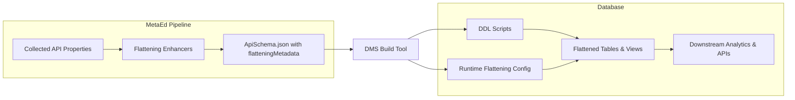
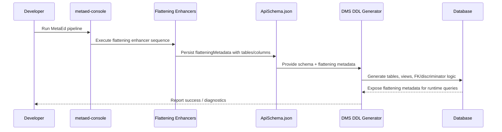

# Technical Design: Flattening Metadata Implementation

## Summary
- **Context**: MetaEd must extend `ApiSchema.json` with relational flattening metadata so the Data Management Service (DMS) can materialize Ed-Fi resources into SQL schemas. This design formalizes how the MetaEd pipeline produces the metadata and how downstream DMS components consume it.
- **Objectives**: Deliver complete recursive table metadata for every resource (core, extensions, common types), enrich it with typing and reference data, and enable DMS to generate DDL and runtime flattening logic without re-analyzing model artefacts. Scope aligns with DMS-830 and the Level 0 plan “Complete Flattening Metadata Implementation.”
- **Reference**: `/home/brad/work/dms-root/Data-Management-Service/reference/design/flattening-metadata-design.md` (original design baseline)

## Outstanding Decisions & Open Questions
- **Name length handling**: Confirm where hash/truncation occurs when identifiers exceed DB limits (enhancer vs. DDL generator).
- **Database schema placement**: Decide whether flattened tables live under project schemas (e.g., `edfi.Student`) or use prefixed names in a shared schema (e.g., `dms.edfi_Student`).

## Requirements
- **Functional**
  - Extend each `resourceSchema` entry with `flatteningMetadata.table` describing recursive table hierarchies, columns, and JSON paths.
  - Provide column annotations for natural keys, required fields, parent references, polymorphic references, descriptor FKs, and data types.
  - Populate abstract resource metadata (`abstractResources[..].flatteningMetadata`) with subclass lists and union view hints.
  - Supply helper metadata (`fromReferencePath`, `isSuperclassIdentity`, etc.) that allows DMS to reuse existing `documentPathsMapping` and avoid duplicate analysis.
  - Emit metadata for extensions and nested collections, including extension-only schemas and common-type extensions.
  - Surface polymorphic relationships to drive discriminator columns and view construction.
- **Non-Functional**
  - Preserve immutability across enhancers and use branded types to avoid ambiguous string handling.
  - Maintain compatibility with PostgreSQL and SQL Server naming/type constraints via abstract column descriptors.
  - Ensure enhancer sequencing integrates with existing MetaEd stages without regressions.
  - Support incremental builds and editor-driven runs without destabilizing the pipeline (no uncaught exceptions, deterministic output).

## Proposed Architecture
### High-Level Overview
- MetaEd’s API Schema plugin gains a suite of flattening enhancers that collaboratively build the metadata structure.
- Output metadata is embedded within `ApiSchema.json` and consumed by DMS tooling for DDL generation and runtime flattening.
- A unified descriptor table and polymorphic resolution utilities bridge JSON documents to relational storage.



### Component Responsibilities
- **Shared helpers** (`TableBuilder`, `ColumnFactory`, `ReferenceMapper`, `SqlTypeDeriver`): Immutable utilities that transform collected API data into flattening structures.
- **FlatteningMetadataInitializerEnhancer**: Seeds root table metadata and captures superclass identity context.
- **FlatteningTableStructureEnhancer**: Walks `collectedApiProperties`/`allJsonPathsMapping` to build recursive child tables for collections and extensions.
- **FlatteningColumnBuilderEnhancer**: Emits scalar and parent reference columns, enforcing natural key propagation.
- **FlatteningReferenceEnhancer**: Resolves resource and descriptor references, tagging polymorphic relationships and discriminators.
- **FlatteningTypeDecoratorEnhancer**: Applies abstract SQL types, length/precision metadata, and descriptor semantics.
- **AbstractResourceFlatteningEnhancer**: Populates abstract resource metadata and flags superclass identity columns.
- **PolymorphicReferenceEnhancer**: Finalizes polymorphic annotations and validates discriminator coverage.

### Data & Control Flow


## Detailed Design
### Modules & Enhancers
- **Initializer**
  - Input: `resourceSchema`, identity metadata, superclass info.
  - Output: `flatteningMetadata.table` skeleton with root JSON path `$`, base name, placeholder arrays.
  - Captures `discriminatorValue` for subclasses and marks `isExtensionTable` when root path begins with `$._ext`.
- **Table Structure Enhancer**
  - Recursively traverses API properties to build child table nodes.
  - Derives table base names using PascalCase and avoids string heuristics by relying on property metadata (collection/common type flags).
  - Handles nested extensions by following `_ext.<project>` markers.
- **Column Builder**
  - Creates column entries for scalar properties, parent references (`<ParentTable>_Id`), and inherited natural keys.
  - Ensures natural keys are emitted exactly once per table and recorded via `isNaturalKey`.
  - Uses helper factories to keep operations immutable and type-safe.
- **Reference Enhancer**
  - Scans properties with `referencedEntity` or descriptor type to create FK columns (`fromReferencePath`).
  - Sets `isPolymorphicReference`, `polymorphicType`, and produces discriminator placeholders (`isDiscriminator`).
  - Differentiates required vs. optional references using property metadata.
- **Type Decorator**
  - Maps MetaEd property types to abstract SQL types (string, boolean, decimal, descriptor, etc.).
  - Attaches `maxLength`, `precision`, `scale` from property attributes.
  - Marks descriptor columns for downstream FK targeting of the unified descriptor table.
- **Abstract Resource Enhancer**
  - Writes `abstractResources[..].flatteningMetadata` with `subclassTypes` and `unionViewName`.
  - Tags subclass columns with `isSuperclassIdentity` for DDL generators to link natural keys.
- **Polymorphic Reference Enhancer**
  - Validates discriminator coverage, ensures discriminator columns are added alongside polymorphic FKs, and cross-checks subclass listings.
- **Pipeline Ordering**
  - Enhancers execute in dependency order: Initializer → TableStructure → ColumnBuilder → Reference → TypeDecorator → AbstractResource → PolymorphicReference, respecting MetaEd’s immutability expectations.

### Interfaces & Contracts
```typescript
export type FlatteningMetadata = {
  table: TableMetadata;
};

type TableMetadata = {
  baseName: string;
  jsonPath: string;
  columns: ColumnMetadata[];
  childTables: TableMetadata[];
  isExtensionTable?: boolean;
  discriminatorValue?: string;
};

type ColumnMetadata = {
  columnName: string;
  columnType: ColumnType;
  jsonPath?: string;
  maxLength?: string;
  precision?: string;
  scale?: string;
  fromReferencePath?: string;
  isNaturalKey?: boolean;
  isRequired?: boolean;
  isParentReference?: boolean;
  isPolymorphicReference?: boolean;
  polymorphicType?: string;
  isDiscriminator?: boolean;
  isSuperclassIdentity?: boolean;
};

type ColumnType =
  | 'bigint'
  | 'boolean'
  | 'currency'
  | 'date'
  | 'datetime'
  | 'decimal'
  | 'descriptor'
  | 'duration'
  | 'integer'
  | 'percent'
  | 'short'
  | 'string'
  | 'time'
  | 'year'
  | 'unknown';
```
- Enhancers must only append data under their plugin namespace, keeping existing metadata immutable.
- `fromReferencePath` keys must align exactly with `documentPathsMapping` entries to guarantee downstream consistency.
- Abstract resource metadata contracts ensure DDL generators can produce union views and discriminator constraints.

### Data Model & Schema Changes
- **ApiSchema.json** gains `flatteningMetadata` under each `resourceSchema` and `abstractResource` entry.
- **Descriptor relational table**: DMS introduces a unified `dms.Descriptor` table keyed by surrogate `Id` with indexes on `(ReferentialPartitionKey, ReferentialId)` to support FK lookup.
- **Polymorphic views**: Union views (e.g., `edfi.EducationOrganization`) provide logical FK targets when multiple concrete tables exist.
- **Generated DDL** adds discriminator columns and check constraints for polymorphic references, and parent FK columns for collections.

### Error Handling & Observability
- Enhancers should validate assumptions (e.g., missing `documentPathsMapping` entries) and emit structured warnings rather than throwing.
- Logging hooks in the MetaEd console should summarize enhancer counts and highlight polymorphic resources processed.
- DDL generators log unresolved references, aiding diagnosis of missing metadata or descriptor entries.

## Testing Strategy
- **Unit Tests (Jest, `npx jest path/to/test.ts`)**
  - Helper coverage (`TableBuilder`, `ColumnFactory`, etc.).
  - Enhancer-specific cases: collections, nested extensions, reference mapping, type decoration, polymorphic handling.
- **Integration Tests**
  - End-to-end `FlatteningMetadataIntegration.test.ts` exercising a representative MetaEd project with collections, references, polymorphism, and extensions.
  - Snapshot-based assertions (`toMatchInlineSnapshot`) for complete table/column trees.
- **Validation Tests**
  - Schema compliance: validate generated `ApiSchema.json` against flattening metadata JSON schema.
  - DDL smoke tests: run generator on sample output and lint resulting SQL for missing constraints.
- **Regression Guards**
  - Lint rule or custom check to forbid string heuristics for model inference.
  - Verify enhancer ordering through a regression suite to prevent accidental sequence changes.

## Deployment & Operations
- **Build Integration**: Flattening enhancers execute within existing MetaEd build (`metaed-console`). No additional NPM scripts required.
- **Runtime Consumption**: DMS startup ingests the enriched `ApiSchema.json`, runs DDL generation, and provisions descriptor tables/views before flattening documents.
- **Configuration**: Database connection strings, schema naming conventions, and optional view materialization toggles are supplied via existing DMS configuration files.
- **Rollout Plan**
  - Stage in feature branches, run `npx jest` suites and `npm run metaed:build` to validate artifacts.
  - Deploy to non-production DMS environments, backfill descriptors, and execute flattening dry runs.
  - Monitor runtime metrics (flattening throughput, descriptor lookup latency) before promoting to production.

## Security & Compliance
- Flattened tables inherit PII from core resources; enforce existing transport encryption and access controls at DB and application layers.
- Descriptor table introduces no new sensitive data but must follow retention and audit requirements.
- Ensure discriminator columns do not leak unnecessary tenant-specific identifiers; they should mirror resource names only.
- Validate that hashing/truncation decisions for long identifiers maintain referential integrity and avoid collisions.

## Risks & Mitigations
- **Incomplete polymorphic coverage**: Missing subclass listings could break discriminator logic. Mitigation: unit tests verifying each polymorphic superclass enumerates all concrete types.
- **Descriptor sync drift**: Inaccurate Descriptor table population would cascade into FK failures. Mitigation: migration scripts with verification queries and monitoring on descriptor upserts.
- **Performance regressions**: Extensive union views or stored procedure lookups might slow high-volume workloads. Mitigation: optional materialized/indexed views and targeted profiling before go-live.
- **Identifier length decisions unresolved**: Pending agreement on truncation may block downstream DDL. Mitigation: schedule spike to prototype naming strategies and document outcome.

## Appendix
- **Source Design**: `/home/brad/work/dms-root/Data-Management-Service/reference/design/flattening-metadata-design.md`
- **Related Plan Artifacts**: `.plans/level-0/plan.md`, `.plans/level-0/tasks.md`
- **Traceability**: DMS-830 (Flattening Metadata Structure), Level 0 plan “Complete Flattening Metadata Implementation.”
